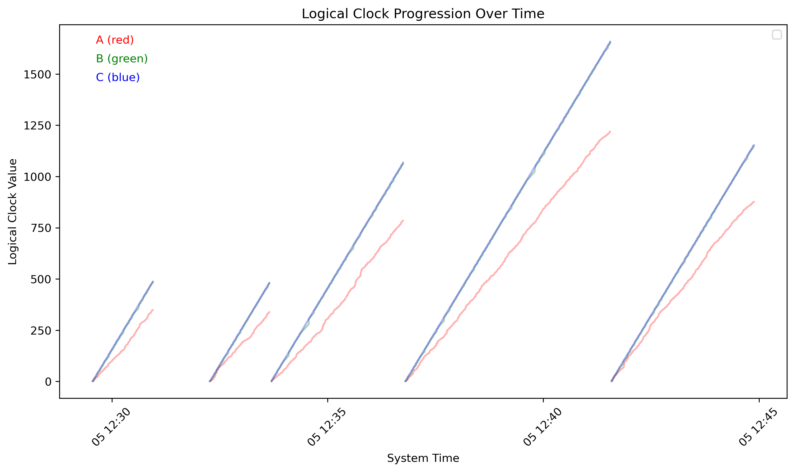

# Engineering Notebook: Scale Models and Logical Clocks

## Overview

For this project, we built a small distributed system that simulates multiple virtual machines (VMs) running at different speeds. The goal was to model how these VMs, with their different internal clocks, interact and how their logical clocks are updated based on events like message passing and internal events. We used logical clocks to keep track of the order of events in a distributed system, which helped us understand how asynchronous systems can stay in sync without a global clock.

Each VM communicates with other VMs through gRPC messages. These messages contain the logical clock value of the sending VM, and the receiving VM updates its logical clock based on this value. We also introduced some randomness to make the simulation feel more like a real-world system where events don’t always happen in a predictable pattern.

---

## File Breakdown

### 1. `logic_clock.proto`

The `logic_clock.proto` file is the foundation of the system’s communication. It defines:

- **Messages**:
  - `MessageRequest`: This is the message sent by one VM to another. It contains the logical clock value (`clock`) and any content (in our case, just a simple string).
  - `MessageReply`: A reply from the receiving VM indicating that the message was successfully processed.
  
- **Service**:
  - `VMService`: This service has a single method, `SendMessage`, which allows VMs to send messages to each other. The message includes the logical clock value, which is used to update the receiving VM’s logical clock.

This file is written in Protocol Buffers (protobuf), which is a way to define the structure of messages and services used in communication. We used this to automatically generate Python code that handles the message serialization and gRPC communication.

---

### 2. `config.json`

The `config.json` file holds the configuration for each VM. It defines:

- `name`: The unique name of each VM (e.g., A, B, C).
- `port`: The port number where the VM listens for incoming gRPC messages.
- `clock_rate`: The clock rate of the VM, which determines how fast the VM runs its logical clock (i.e., how many clock ticks per real-world second).

This file is important because it lets us easily customize the number of VMs, their clock rates, and their communication ports. It’s a simple way to configure the system before running the simulation.

---

### 3. `logic_clock_pb2.py` and `logic_clock_pb2_grpc.py`

These files were automatically generated from the `logic_clock.proto` file using the Protocol Buffers compiler. They define:

- **`logic_clock_pb2.py`**: This file contains Python classes that match the protobuf messages, like `MessageRequest` and `MessageReply`, along with methods to serialize and deserialize these messages.
- **`logic_clock_pb2_grpc.py`**: This file contains the server and client classes for gRPC communication. It allows the VMs to send and receive messages through the `VMService`.

We didn’t write these files manually—they were generated for us and are necessary for the communication between VMs using gRPC.

---

### 4. `main.py`

The `main.py` file is the core of the simulation. It:

- **Initializes the VMs**: It reads the `config.json` file to load the VM configurations (name, port, clock rate).
- **Starts the gRPC Server**: For each VM, it starts a gRPC server on a separate thread that listens for incoming messages.
- **Runs the Logical Clock Loop**: Each VM runs a loop where it waits for messages, processes them if they’re available, or generates internal events (or sends messages to other VMs) based on its logical clock and a random number generator.
- **Handles Shutdown**: It ensures that the program shuts down gracefully when interrupted.

This file coordinates the entire simulation and manages how the VMs communicate and update their logical clocks.

---

### 5. `tools.py`

The `tools.py` file contains some helper functions that we used in the project:

- **`init()`**: This function initializes the list of VMs by reading the `config.json` file.
- **`send_message_to_peer()`**: This function is used to send a message from one VM to another. It sends the current logical clock value and some content.
- **`get_peers()`**: This function returns a list of peer VM names based on the current VM’s name. For example, VM "A" communicates with VMs "B" and "C". This approach keeps things simple and easy to manage, but we could modify it in the future to make the peer selection more dynamic.

These functions help keep the code organized and make it easier to send messages between VMs and manage peer relationships.

---

## Design Decisions

### Logical Clocks

For the logical clocks, we followed Lamport’s logical clock algorithm. Each VM keeps track of its own logical clock. Whenever a VM receives a message, it updates its logical clock using the formula:  
`local_logical_clock = max(local_logical_clock, received_clock) + 1`.  
This ensures that events are ordered correctly even if the VMs have different internal clock rates.

We decided to use logical clocks instead of real-time clocks because in a distributed system, the machines don’t share a global clock, and events can happen asynchronously.

### Clock Rate

Each VM has a clock rate, which defines how many logical clock ticks it processes per second. The clock rate is set in the `config.json` file. For example, a VM with a clock rate of 2 processes 2 events every real-world second.

The clock rate introduces variability between the VMs, which helps simulate how real distributed systems can have machines running at different speeds.

### Message Passing

We chose to use gRPC for communication between the VMs. It’s lightweight and efficient, making it a good fit for our simulation. Each VM listens on a specific port and can send or receive messages from other VMs using the `VMService`.

- When a VM sends a message, it includes its logical clock value.
- When a VM receives a message, it updates its logical clock based on the sender’s clock value.

This way, the logical clocks stay consistent across the system, even though the VMs run at different speeds.

### Randomness in Event Generation

To make the simulation more dynamic, we added randomness to how each VM behaves. Each VM generates a random number between 1 and 10, and based on this value, it either:

1. Sends a message to one peer.
2. Sends a message to another peer.
3. Sends messages to both peers.
4. Processes an internal event.

This randomness mimics the unpredictable nature of real-world systems, where events don’t always happen in a predictable sequence.

### Peer Communication

In our system, each VM communicates with a fixed number of peers. The `get_peers()` function returns a list of peer VM names based on the current VM’s name. For example, VM "A" communicates with VMs "B" and "C". This approach keeps things simple and easy to manage, but we could modify it in the future to make the peer selection more dynamic.

---


## Log File Examination

In the `log_analysis.py` file, we read the log file for each VM and each run, and analyze the jumps in the values for the logical clocks, the drifts in the values of the logical clocks in the different machines, and the message queue length of each machine, in order to examine their relationship with the clock speed.

### Logical Clock Jumps

The descriptive statistics for logical clock jumps in each machine are as follows:

```
Descriptive Statistics for VM A:
count    1648.000000
mean        2.162015
std         1.872328
min         1.000000
25%         1.000000
50%         1.000000
75%         3.000000
max        16.000000
Name: clock_diff, dtype: float64

Descriptive Statistics for VM B:
count    3264.000000
mean        1.479779
std         1.701135
min         1.000000
25%         1.000000
50%         1.000000
75%         1.000000
max        25.000000
Name: clock_diff, dtype: float64

Descriptive Statistics for VM C:
count    4844.0
mean        1.0
std         0.0
min         1.0
25%         1.0
50%         1.0
75%         1.0
max         1.0
Name: clock_diff, dtype: float64
```

It is clear that VM A has the highest average clock jump size (2.16), then VM B (1.48) and VM C (1.00). Logical clock jump occurs only when a VM triggers a `RECEIVE` event (a necessary but not sufficient condition), so that the clock from another VM is synchronized to the current VM clock (if the fetched clock is faster). For example, in the `log/B.0.log`:

```
2025-03-05 12:29:33 [B] [INTERNAL] Logical Clock: 1
2025-03-05 12:29:34 [B] [INTERNAL] Logical Clock: 2
2025-03-05 12:29:34 [B] [INTERNAL] Logical Clock: 3
2025-03-05 12:29:34 [B] [RECEIVE ] from: A, Queue Length: 1, Logical Clock: 4
2025-03-05 12:29:34 [B] [RECEIVE ] from: C, Queue Length: 1, Logical Clock: 7
```
In VM B, the logical clock often increases by 1 during internal events, but when it got a RECEIVE event from VM C, we see jumps from 4 to 7. This indicates that the received message had a logical clock value (VM C, 6 executions per second) much higher than B’s local clock, forcing an update via the rule max(local, received) + 1. This explains why the average clock jump size increases as the clock speed decreases.

### Drift Between Machines



### Message Queue Length

```
Queue Length Statistics for VM A:
count    1649.000000
mean       70.970285
std        49.101697
min         1.000000
25%        34.000000
50%        60.000000
75%       103.000000
max       199.000000
Name: queue_length, dtype: float64

Queue Length Statistics for VM B:
count    452.000000
mean       1.024336
std        0.154262
min        1.000000
25%        1.000000
50%        1.000000
75%        1.000000
max        2.000000
Name: queue_length, dtype: float64

Queue Length Statistics for VM C:
count    293.0
mean       1.0
std        0.0
min        1.0
25%        1.0
50%        1.0
75%        1.0
max        1.0
Name: queue_length, dtype: float64
```

## Conclusion

Overall, this project successfully simulated a simple asynchronous distributed system with logical clocks. It helped us understand how machines with different clock rates can interact in a distributed environment and how their logical clocks can stay consistent despite running asynchronously. The system’s design is flexible, and we could easily scale it by adding more VMs or changing the communication patterns. We learned a lot about how distributed systems work and how important logical clocks are for maintaining event order.

---
